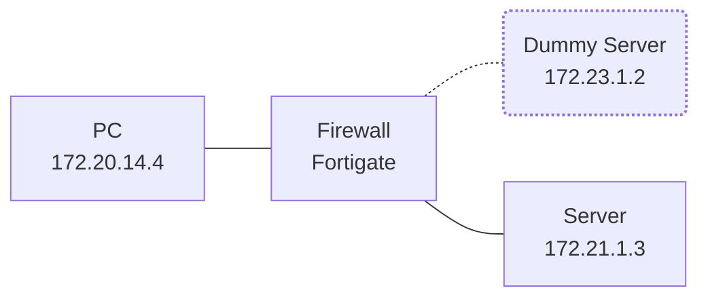

## วิธีทำ DNAT บน FortiGate (LAN to LAN)

### 1. สร้าง Virtual IP (VIP)
ไปที่ `Policy & Objects > Virtual IPs` แล้วกด `Create New`:
- Name: เช่น `DNAT_172.23.1.2_to_172.21.1.3`
- Interface: เลือก interface ที่รับ packet จากฝั่ง source (ในที่นี้อาจจะเป็น interface ที่เชื่อมกับ `172.20.14.0/24`)
- External IP Address / Range: ใส่ `172.23.1.2` (คือ IP ปลายทางที่ต้นทางจะยิงหา)
- Mapped IP Address / Range: ใส่ `172.21.1.3` (คือ IP จริงที่เราต้องการให้ไปถึง)

### 2. สร้าง Firewall Policy
ไปที่ `Policy & Objects > IPv4 Policy` แล้วกด `Create New`:
- Incoming Interface: Interface จาก LAN ฝั่งต้นทาง (`172.20.14.0/24`)
- Outgoing Interface: Interface ไปยังปลายทางจริง (`172.21.1.0/24`)
- Source: ระบุ `172.20.14.11` หรือ subnet ที่เกี่ยวข้อง
- Destination: เลือก VIP ที่สร้างไว้ (`DNAT_172.23.1.2_to_172.21.1.3`)
- Service: ตามต้องการ เช่น `ALL` หรือเฉพาะ port ที่ต้องการ
- Action: `Accept`
- NAT: ไม่ต้องติ๊ก NAT (เพราะเราไม่ต้องการเปลี่ยน source IP)

### 3. ทำ Static Route แบบ Dummy (Optional)
ในกรณีที่ปลายทางไม่มีอยู่จริง `172.23.1.2` เราต้องสร้าง Static Route ด้วย โดยชี้ไปที่ Default Gateway `0.0.0.0`  
ไปที่ `Network > Static Routes` แล้วกด `Create New`:
- Destination IP/Mask: `172.23.1.2/32` (หรือ `172.23.1.0/24` ถ้าคุณอยากรองรับหลาย IP)
- Gateway: สามารถใส่เป็น `0.0.0.0`
- Interface: ใส่ interface ที่รับ traffic มาจากฝั่ง LAN (หรือฝั่งที่ทำ NAT ก็ได้ เช่นเดียวกับ VIP)
- Distance: ให้ใช้ default (10)

